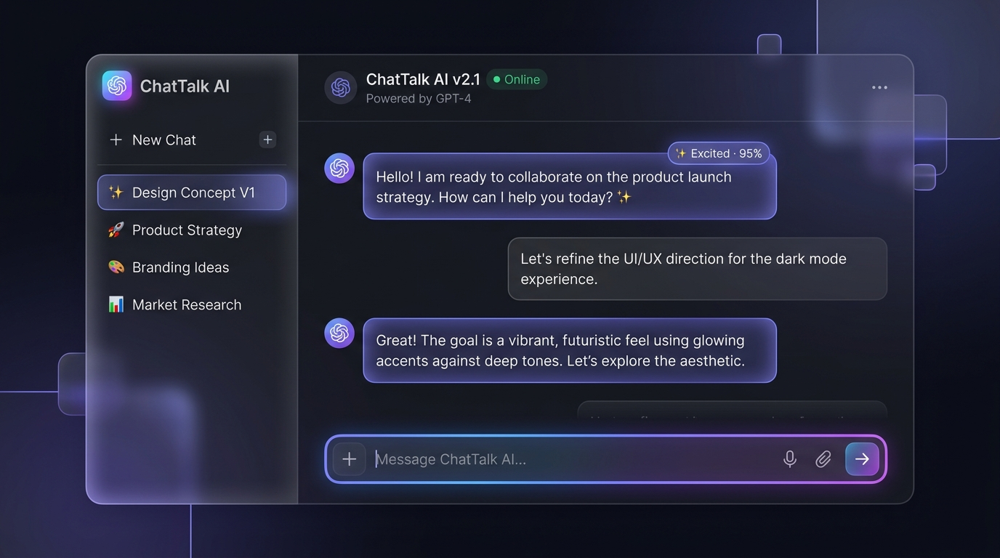

# 💬 ChatTalk — Tone-Aware AI Companion

ChatTalk is a vibrant, interactive Streamlit AI chat application powered by local LLMs (Ollama) with cloud fallback capabilities (Groq API). It detects conversation tone in real-time, adapts its persona, and streams responses through a dark glassmorphic UI.

---

## 🖼️ Interface Preview



---

## ✨ Key Features

- ⚡ **Real-Time Streaming**: Live word-by-word streaming responses with visual typing indicators.
- 🎭 **Tone-Aware Persona Engine**: Detects emotional tone (excited, calm, serious, playful, sad, angry) and adapts assistant style and vocabulary automatically.
- 🪞 **Slang & Style Mirroring**: Automatically matches the user's conversation energy and language nuances.
- 🧠 **Dual LLM Architecture**:
  - **Primary**: Local LLM via Ollama (`llama3.2`, `qwen2.5`, etc.).
  - **Fallback**: OpenAI-compatible cloud API via Groq (`llama-3.1-8b-instant`) when local server is offline or deployed to the cloud.
  - **Placeholder Safety**: Fallback placeholder mode keeps the UI functional if no network or API keys are available.
- 💾 **Persistent Chat Storage**: Session-based history management with SQLite/JSON storage, multi-session switching, history undo, and export options.
- 🎨 **Modern Glassmorphic UI**: Floating glass chat input, responsive sidebar, status pills, and dark mode styling.

---

## 📁 Project Structure

```
ChatTalk/
├── app.py                 # Streamlit UI & styling
├── llm.py                 # LLM provider routing (Ollama, Groq, Streaming, Fallback)
├── prompts.py             # Tone detection, prompt building & style mirroring
├── storage.py             # SQLite/JSON chat session persistence
├── assets/
│   └── chattalk_preview.png # Application preview screenshot
├── tests/
│   ├── test_llm.py        # LLM transport & config tests
│   ├── test_prompts.py    # Tone detection & prompt tests
│   └── test_storage.py    # Persistence tests
├── requirements.txt       # Project dependencies
├── pytest.ini             # Test configuration
├── .env.example           # Environment template
└── README.md              # Documentation
```

---

## 🚀 Running Locally

### 1. Prerequisites
- Python 3.10+
- [Ollama](https://ollama.com/) (for running local models such as `llama3.2` or `qwen2.5`)

### 2. Setup Virtual Environment
```powershell
# Create & activate environment
python -m venv .venv
.\.venv\Scripts\Activate.ps1

# Install requirements
pip install -r requirements.txt
pip install pytest
```

### 3. Configure Environment Variables
Copy `.env.example` to `.env`:
```powershell
copy .env.example .env
```

Edit `.env` to match your local setup:
```env
LLM_PROVIDER=ollama
LLM_MODEL=llama3.2
LLM_BASE_URL=http://localhost:11434

# (Optional) Fallback for cloud deployment
FALLBACK_PROVIDER=groq
FALLBACK_MODEL=llama-3.1-8b-instant
FALLBACK_API_KEY=your_groq_api_key_here
```

### 4. Run the Application
```powershell
streamlit run app.py
```
Open [http://localhost:8501](http://localhost:8501) in your browser.

---

## ☁️ Deploying to Streamlit Cloud

When deploying to Streamlit Cloud (where local Ollama is not running), configure your Groq API key in **Streamlit Cloud -> App Settings -> Secrets**:

```toml
FALLBACK_PROVIDER = "groq"
FALLBACK_MODEL = "llama-3.1-8b-instant"
FALLBACK_API_KEY = "gsk_your_groq_api_key_here"
```

The app will seamlessly route requests to Groq when the local Ollama server is unreachable.

---

## 🧪 Testing

Run the full test suite with pytest:

```powershell
pytest
```

All 62 unit tests verify tone detection, prompt generation, streaming response generation, storage persistence, and provider error handling.
